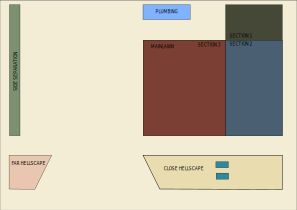

# Landscape 🌵🌲🌾🌺🌿

This repo contains information that I've used to transfer sections of our yard
into one that primarily uses California Native species. This allows us to have
reduced water usage, support local fauna, and it should also look pretty swell.

# Sections ✂️

There are 4 sections that make up the front yard:

- Plumbing (See Hellscape)

 - [Hellscapes](hellscapes/README.md)

 - Main Lawn (Section Coming Soon)

 - Side Separation (Later)

To get a feel of the amount of labour it takes to finish of a section I decided 
to work on the smaller sections first, then work my way to the larger yard.
The main lawn was broken into 3 different sections that will be addressed in
different stages, this allows me to complete the more complex work in section 3
at a later time. 

# Permits / Building Code 🔍 📗

This is a reference for some landscaping building details in my area:

[Landscaping building standards](https://www.fremont.gov/1066/Landscape-Standard-Details)

[Article II. Duty of Property Owners to Maintain Street Trees and Sidewalks](https://www.fremont.gov/faq.aspx?qid=610)

# Resources ℹ

[Olivier Filippi - Lawn Alternatives in Mediterranean Gardens](https://vimeo.com/102817124)

[Manzanitas - Pete Veilleux](https://www.youtube.com/watch?v=29i4EFJEi3gt)

# Reducing Material Cost 💸

The biggest thing is don't use hardware stores to buy hardscape material, you
will probably find a better deal on rocks through a landscaping whole-seller.
The one that I use is [Clark`s Home and Garden](http://clarkshomeandgarden.com/).
The pricing is way more competitive. They even sell a higher quality weed barrier
at a more affordable price.

# Pro Advice

- Use a pickaxe to remove old grass
- Get the weed barrier from your rock yard, it will be cheaper, and better
  quality.
- Double layer the weed barrier if there is <3in of substrate on it.

# Installing New Plants

For best results, plant in late fall, winter, or early spring. Hot summer or early fall conditions are a difficult time to start most non-riparian plants. It's usually best to start with 1 gallon plants. Within 2-3 years after planting they'll be as big as the plants that started out in 5 gallon containers. Root-bound plants should not be planted as they will never develop a healthy root structure and are not likely to live long.

When putting your plants in the ground, dig a square hole that is twice as wide and half again as deep as the container. (Square holes prevent the roots from wrapping after planting.) If planting on a dry bank or slope, it's best to create a flat area around the hole too, at least twice the diameter of the hole. It'll help the new plant retain just a bit more water. If the soil is very dry, fill the hole with water and let it soak through before continuing. Rough up the sides and bottom of the hole so the roots will be able to dig in as they grow. Put back enough loose dirt in the bottom of the holes, so that when you put the plant in the hole, the root ball is about 1/2" higher than the surrounding grade.

Don't rough up the roots of native plants when you take them out of the container. It's best to leave their roots as undisturbed as possible. Tamp loose dirt gently into the gap around the plant, but don't push down on the root ball itself.

Put rocks and/or organic mulch around the plant to shade its roots and help the new plant get started. Rocks are best since they don't soak up any water, won't block air flow, and won't wick moisture away from the soil. If you use organic mulch like shredded bark, just put down a light and thin (~2-3") layer. Much more than this will soak up too much rainwater and prevent it from it from passing through to the plants. Light airy organic mulches are better than heavy ones. Heavy organic mulches tamped down on the soil will soak up rainwater, wick moisture away from the ground and dry out the soil. It can also interrupt proper air flow to the roots. Place your rocks and/or mulch on the exterior half of the root ball and extend out about a foot. Don't cover the interior half of the root ball, or the plant won't be able to breath properly. Over time, the plant will create its own preferred organic mulch by dropping leaves.

# Watering Guide

# Notes

This repo was inspired by the work of [katmeister](https://github.com/katmeister)
and their [tokyo-2019](https://github.com/katmeister/tokyo-2019) repo.
