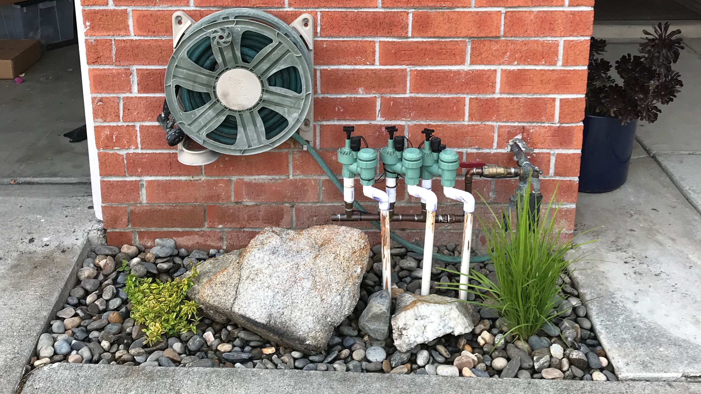
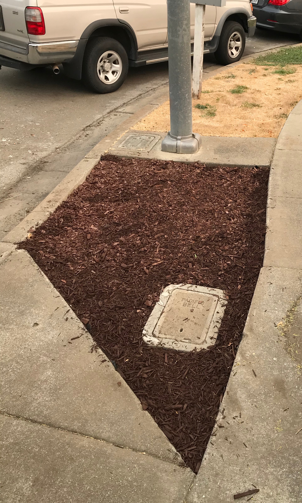
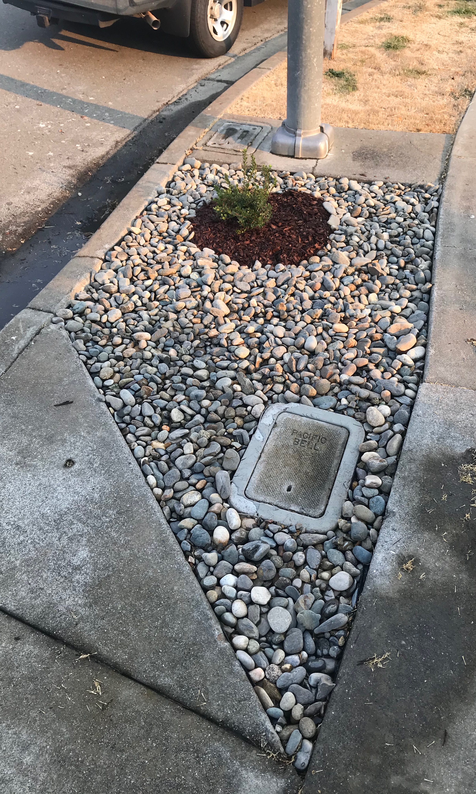
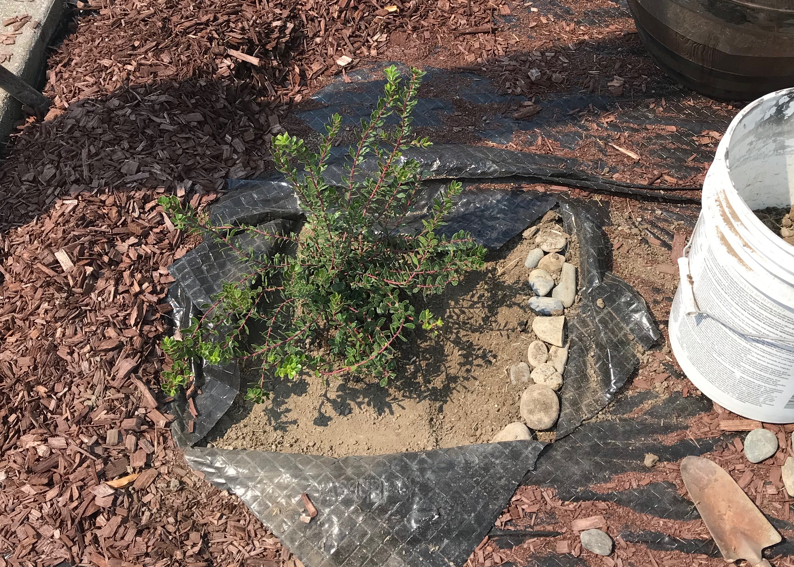

# Landscape 🌵🌲🌾🌺🌿
This repo contains information that I've used to transfer sections of our yard
into one that primarily uses California Native species. This allows us to have
reduced water usage, support local fauna, and it should also look pretty swell.

# Permits / Building Code 🔍 📗
This is a reference for some landscaping building details in my area:

[Landscaping building standards](https://www.fremont.gov/1066/Landscape-Standard-Details)

[Article II. Duty of Property Owners to Maintain Street Trees and Sidewalks](https://www.fremont.gov/faq.aspx?qid=610)

# Resources ℹ
[Olivier Filippi - Lawn Alternatives in Mediterranean Gardens](https://vimeo.com/102817124)

# Planning 📝
There are 5 main spaces to the front yard: 2 hellstrips (planting strip), a 
separation between our and the neighbors property, a small section for plumbing,
then the primary front yard. To get a feel of the amount of labour it takes to 
finish of a section I decided to work on the smaller hellscapes first, then work
my way to the larger yard.

# Reducing Material Cost 💸
The biggest thing is don't use hardware stores to buy hardscape material, you
will probably find a better deal on rocks through a landscaping whole-seller.
The one that I use is [Clark`s Home and Garden](http://clarkshomeandgarden.com/).
The pricing is way more competitive. They even sell a higher quality weed barrier
at a more affordable price. 

## Plumbing Section 🚿
 Overall this section took 2 hours to complete, there was a minimal amount of 
 prep work that needed to be done, the most time/labor expensive part was 
 washing the stones used in the space. Under the rocks there is a layer of 
 weed barrier.

 
|      Materials Used      |    Notes     | Cost (USD) |
| :----------------------: | :----------: | :--------: |
|          Abelia          |              |   $14.99   |
|  Lomandra Confertifolia  |              |   $14.99   |
| 300lbs Noia Pebbles 1.5" | #14 @ Clarks |    $20     |
|   Vigoro Weed Barrier    |              |            |
|                          |              |   $49.98   |

### Section Notes
Performed deep watering every other day to establish roots for this area. The use
of the big rock in the middle is intensional, first it provides protection to the
plastic pipes used for the irrigation system, and it also protects the Abelia from
the hose.

## Far Hellscape 🔥
The far hellscape has gone through more changes due to its smaller size. 
Unfortunately there is no pre-photo showing off the bare dirt and dry grass. But
if you use your imagination after seeing the pre photo from the closer hellscape,
it looks the exact same. Due to this area being the furthest from the water hose
(and there for the most likely to be forgotten to be watered), its important to
use plants in this space that are very drought tolerant.

Version 1 was ok, the primary issues that I had were that squirrels were messing
around in the chips, and that there was a difference in the texture of the two 
different types of mulch that I used. This looked better in my head, after I did
the rocks in the [plumbing-section](#plumbing-section), I realized I had to go 
back and change it.

I used the same type of Noia 1.5" stone from the pumping section, this took 
around 450lbs of stone to complete. The manzanita that was selected will grow
is an `emerald carpet` variety, it should get to be 3-5' wide, and 18-24" tall.
Which is perfect for this space, the key right now is to establish a deep root 
system to ensure long term success.

When planting the Manzanita I created a shallow ring around the plant, this 
allows space for water to pool near the plant and stay close to the root system.
Going forward I plan to plant everything in this way, it should reduce water 
usage in the area. For more information reference
[this](documents/standard-shrub-planting.PDF) document from the city. 

|      Materials Used      |    Notes     | Cost (USD) |
| :----------------------: | :----------: | :--------: |
| Manzanita Emerald Carpet |              |   $14.99   |
| 400lbs Noia Pebbles 1.5" | #14 @ Clarks |    $27     |
|   Vigoro Weed Barrier    |              |            |
|     Vigoro Red Mulch     |              |   $3.99    |
|                          |              |   $44.98   |

### Section Notes
I do think that there can also be some grasses, or a smaller shrub added next
to the pacific bell access hole. I want to see how the Manzanita does before 
adding something else there. I also tend to park on the ridge, do I need to see
what the spacing looks like.

# Notes
This repo was inspired by the work of [katmeister](https://github.com/katmeister)
 and their [tokyo-2019](https://github.com/katmeister/tokyo-2019) repo.
