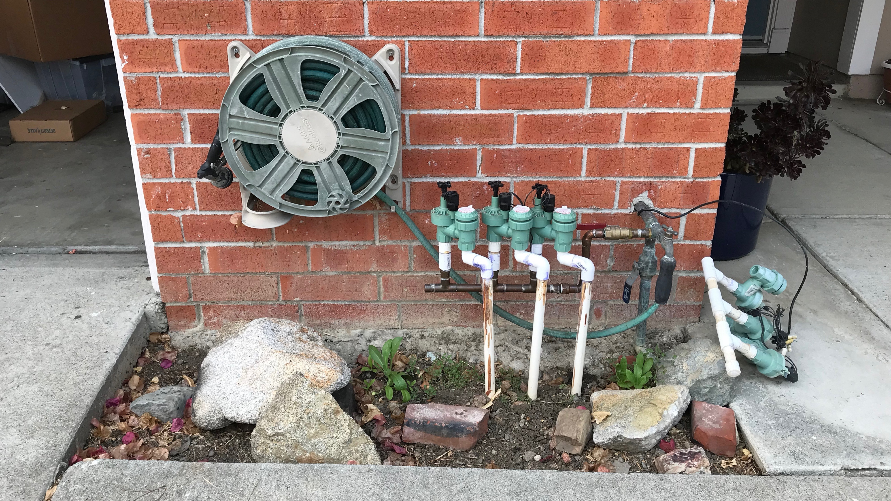

# Landscape 🌵🌲🌳🌾🌺🌿
This repo contains information that I've used to transfer sections of our yard
into one that primarily uses California Native species. This allows us to have
reduced water usage, support local fauna, and it should also look pretty swell.

# Permits / Building Code
This is a reference for some landscaping building details in my area:

[Landscaping building standards](https://www.fremont.gov/1066/Landscape-Standard-Details)

[Article II. Duty of Property Owners to Maintain Street Trees and Sidewalks](https://www.fremont.gov/faq.aspx?qid=610)

# Planning
There are 5 main spaces to the front yard: 2 hellstrips (planting strip), a 
separation between our and the neighbors property, a small section for plumbing,
then the primary front yard. To get a feel of the amount of labour it takes to 
finish of a section I decided to work on the smaller hellscapes first, then work
my way to the larger yard.

## Plumbing Section
 Overall this section took 2 hours to complete, there was a minimal amount of 
 prep work that needed to be done, the most time/labor expensive part was 
 washing the stones used in the space.

 
|      Materials Used      |    Notes     | Cost (USD) |
| :----------------------: | :----------: | :--------: |
|          Abelia          |              |   $14.99   |
|  Lomandra Confertifolia  |              |   $14.99   |
| 300lbs Noia Pebbles 1.5" | #14 @ Clarks |    $20     |
|                          |              |   $49.98   |

### Section Notes
Performed deep watering every other day to establish roots for this area. The use
of the big rock in the middle is intensional, first it provides protection to the
plastic pipes used for the irrigation system, and it also protects the Abelia from
the hose.

# Notes
This repo was inspired by the work of [katmeister](https://github.com/katmeister)
 and their [tokyo-2019](https://github.com/katmeister/tokyo-2019) repo.