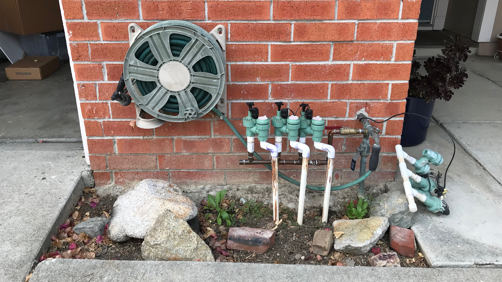
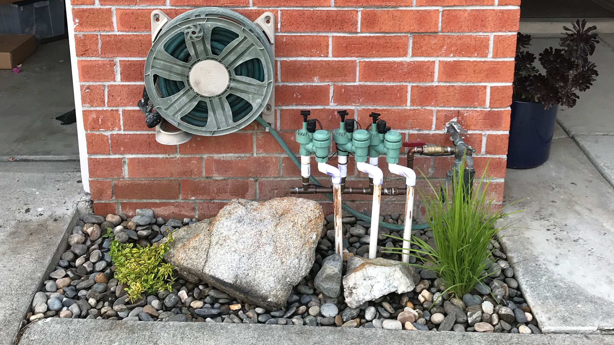
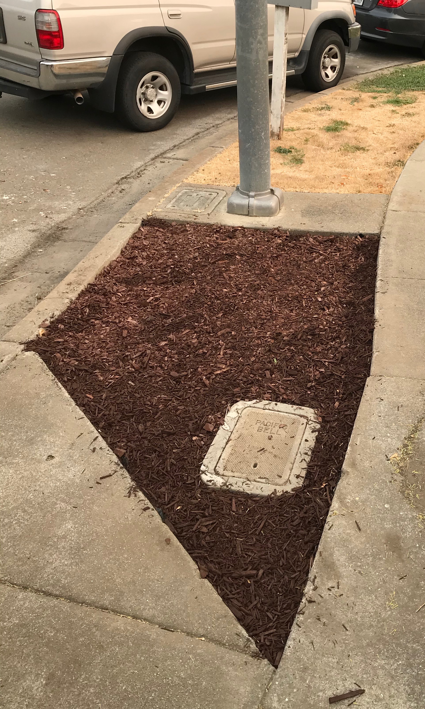
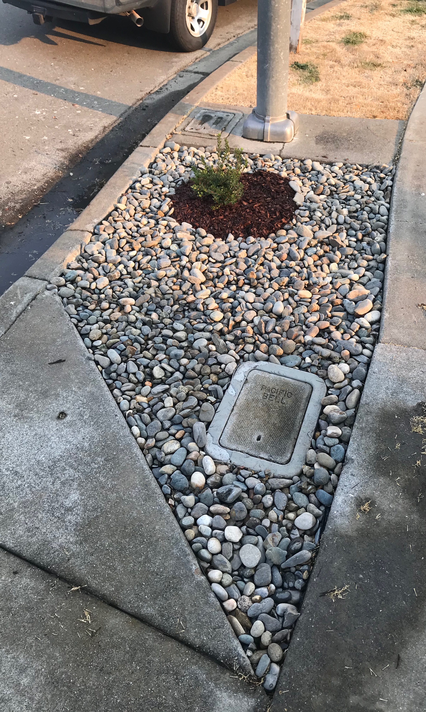
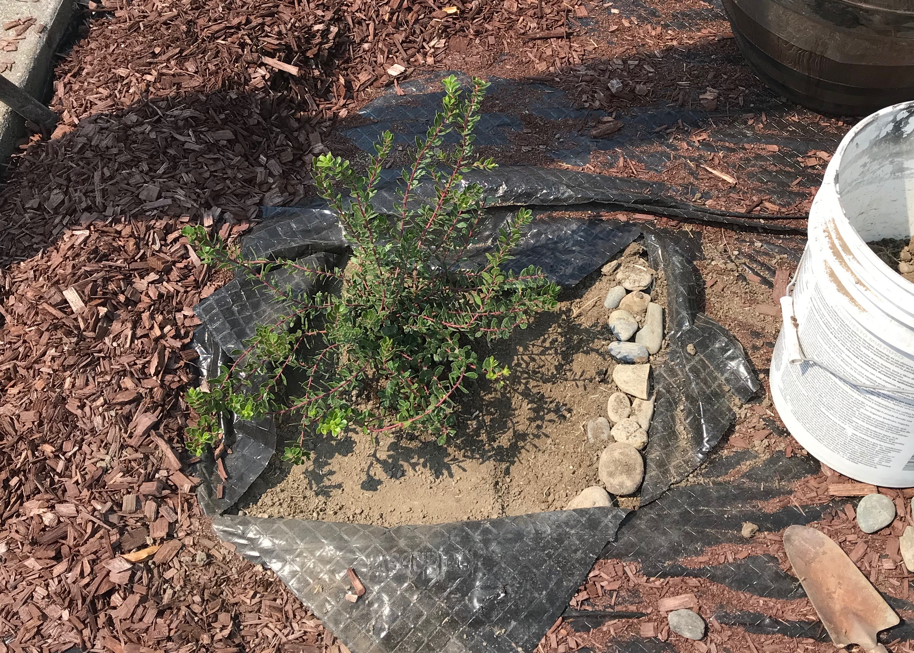
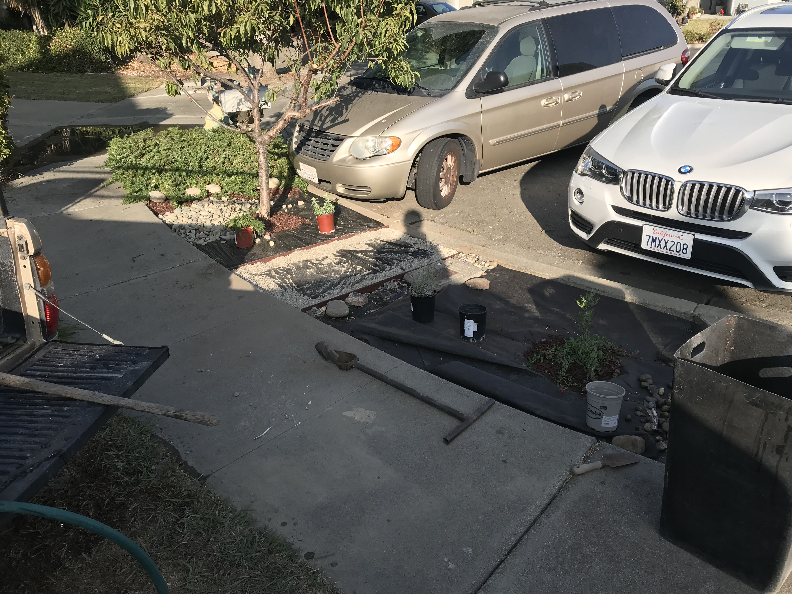
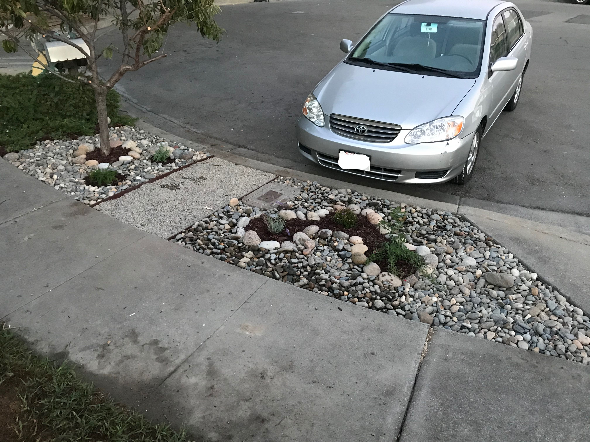

## Plumbing Section 🚿

Overall this section took 2 hours to complete, there was a minimal amount of
prep work that needed to be done, the most time/labor expensive part was
washing the stones used in the space. Under the rocks there is a layer of
weed barrier.

|      Materials Used      |    Notes     | Cost (USD) |
| :----------------------: | :----------: | :--------: |
|          Abelia          |              |  \$14.99   |
|  Lomandra Confertifolia  |              |  \$14.99   |
| 300lbs Noia Pebbles 1.5" | #14 @ Clarks |    \$20    |
|   Vigoro Weed Barrier    |              |            |
|                          |              |  \$49.98   |

### Section Notes

Performed deep watering every other day to establish roots for this area. The use
of the big rock in the middle is intensional, first it provides protection to the
plastic pipes used for the irrigation system, and it also protects the Abelia from
the hose.

## Far Hellscape 🔥

The far hellscape has gone through more changes due to its smaller size.
Unfortunately there is no pre-photo showing off the bare dirt and dry grass. But
if you use your imagination after seeing the pre photo from the closer hellscape,
it looks the exact same. Due to this area being the furthest from the water hose
(and there for the most likely to be forgotten to be watered), its important to
use plants in this space that are very drought tolerant.

|      Materials Used      |    Notes     | Cost (USD) |
| :----------------------: | :----------: | :--------: |
| Manzanita Emerald Carpet |              |  \$14.99   |
| 400lbs Noia Pebbles 1.5" | #14 @ Clarks |    \$27    |
|   Vigoro Weed Barrier    |              |            |
|     Vigoro Red Mulch     |              |   \$3.99   |
|                          |              |  \$44.98   |

Version 1 was ok, the primary issues that I had were that squirrels were messing
around in the chips, and that there was a difference in the texture of the two
different types of mulch that I used. This looked better in my head, after I did
the rocks in the [plumbing-section](#plumbing-section), I realized I had to go
back and change it.

I used the same type of Noia 1.5" stone from the pumping section, this took
around 450lbs of stone to complete. The manzanita that was selected will grow
is an `emerald carpet` variety, it should get to be 3-5' wide, and 18-24" tall.
Which is perfect for this space, the key right now is to establish a deep root
system to ensure long term success.

When planting the Manzanita I created a shallow ring around the plant, this
allows space for water to pool near the plant and stay close to the root system.
Going forward I plan to plant everything in this way, it should reduce water
usage in the area. For more information reference
[this](documents/standard-shrub-planting.PDF) document from the city.

### Section Notes

I do think that there can also be some grasses, or a smaller shrub added next
to the pacific bell access hole. I want to see how the Manzanita does before
adding something else there. I also tend to park on the ridge, do I need to see
what the spacing looks like.

# Close Hellscape

The close hellscape is ~17ft x 5ft space that has a peach tree on one side.
Because this area is closer to the hose (more likely to get watered), we use
that to our advantage.

|           Materials Used           |                  Notes                   | Cost (USD) |
| :--------------------------------: | :--------------------------------------: | :--------: |
|             Peach Tree             |          Grown from random seed          |    \$0     |
|      550lbs Noia Pebbles 1.5"      |               #14 @ Clarks               |    \$?     |
| Vigoro Weed Barrier (Double layer) |                                          |            |
|          Vigoro Red Mulch          |                                          |    \$?     |
|              Lavender              |                                          |  \$17.98   |
|         California Fuchsia         |    2-3ft wide, 1.5ft tall, low water     |  \$10.00   |
|       Island Bush Snapdragon       |    4-5ft wide, 3-4ft tall, low water     |  \$10.00   |
|        Sonoma Coast Yarrow         | 2-3ft wide, .5-1ft tall, low / med water |  \$10.00   |
|              Pebbles               |                                          |   \$4.99   |
|                                    |                                          |  \$44.98   |

The first thing that was done is the removal of the old dead grass sections,
this took several hours to complete, and was left bare for a couple weeds to
ensure everything was dead in that area.

The most effective tool that can be used in this soil is a
[pick-axe](https://en.wikipedia.org/wiki/Pickaxe), it allows you to drag the
broad side through the dead grass and makes easy work to remove it. The
alternative sucks, you have to use a shovel and kick it between the grass and
the dirt. This shoveling process is way slower, I would say it's about 10x
slower. If the soil is unlevel the pick lets you make quick work of the hardened
soil.

Because this hellscape sees daily foot traffic to get to a car / mailbox. It was
important to designate a section that can be used to walk through. To start this
off the peach tree was trimmed down to allow a section between the base of the
tree all the way to the water access hole. There is roughly 36in of space
between them, which is more than enough to walk though.

For the walking path cutout in the hellscape, there is a double layer of the
weed barrier to ensure that nothing grows through the small layer of gravel
above it. I should have dug out the trench that the side guards are sitting
inside before trying to fit the weed barrier. I used the smaller broken rocks
that came part of the Noia rocks from the other sections to hold the guards in
place, gravel on top.

### Winter Update

So far all the plants have been thriving in the cold with the exception of the 
lavender. I think this was due to it being planted too late in the season. It 
may need to be removed to allow for the California Fuchsia to take over that 
space, I'm surprised with how large it is getting.

